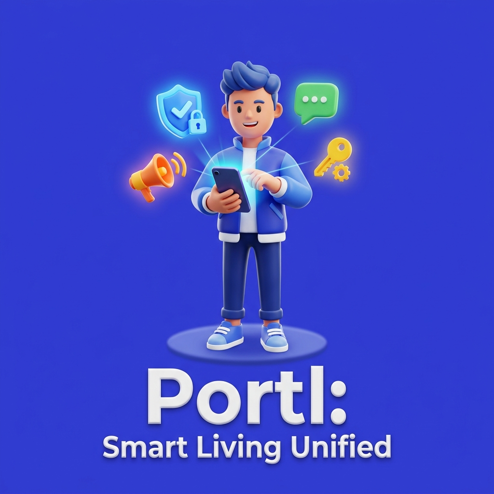
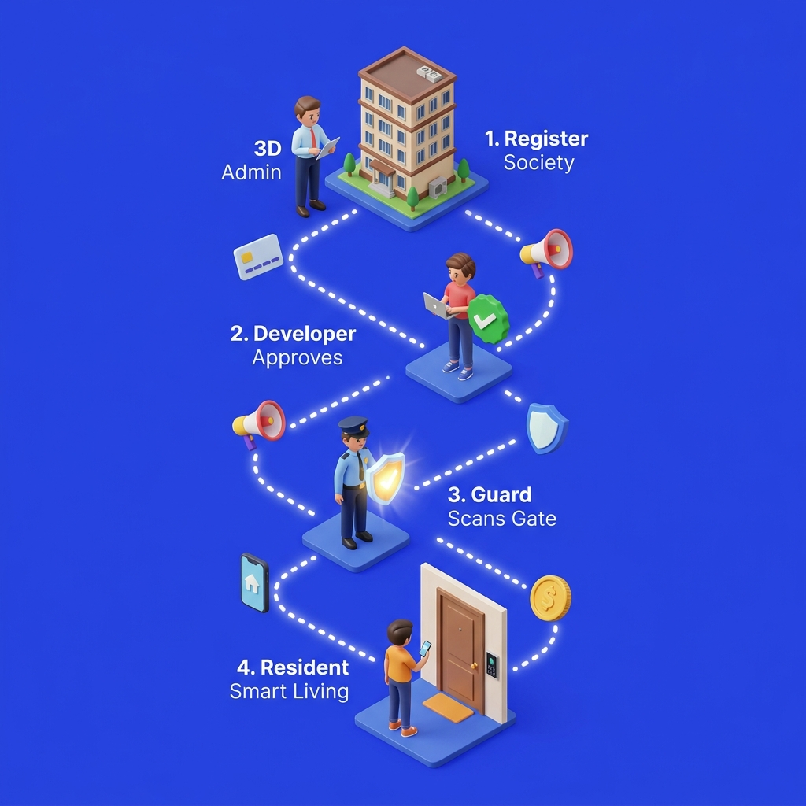
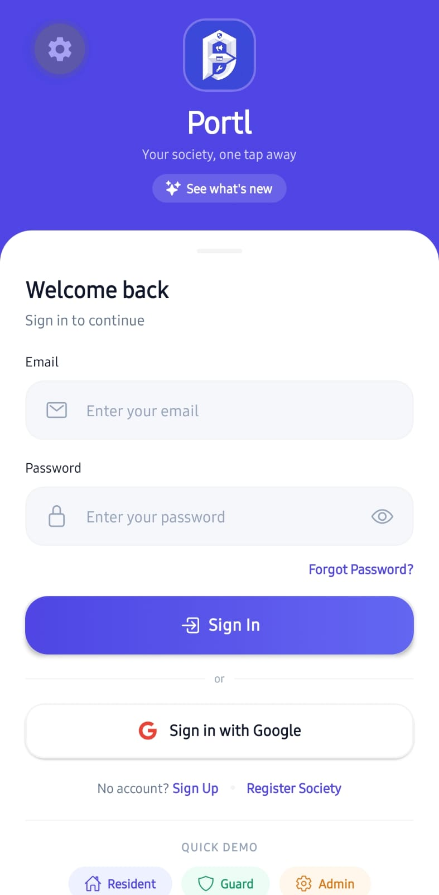
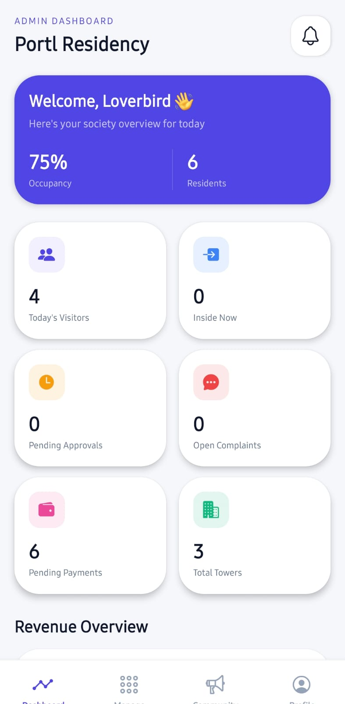
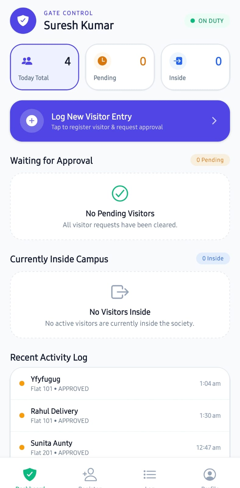
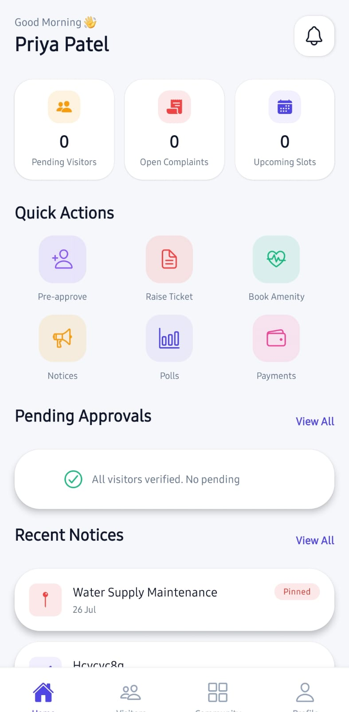
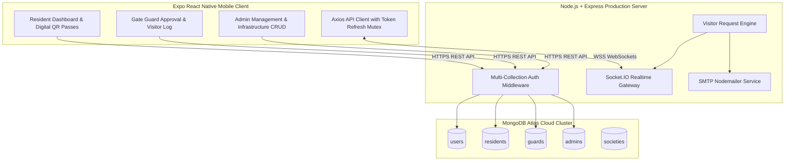

# 🏢 Portl — Smart Society Management & Gate Security Ecosystem

<p align="center">
  
</p>

<p align="center">
  <a href="https://society-management-app-w77v.onrender.com/api/v1/auth/societies"></a>
  <a href="https://expo.dev"></a>
  <a href="https://www.typescriptlang.org/"></a>
  <a href="https://www.mongodb.com/cloud/atlas"></a>
  <a href="#license"></a>
</p>

**Portl** is a state-of-the-art, multi-tenant residency management and gate security application. Designed with modern claymorphism UI design, dynamic micro-animations, real-time WebSockets, digital QR code visitor passes, and automated SMTP email notifications, Portl delivers a seamless experience for **Residents**, **Security Guards**, **Committee Admins**, and **Super Admins**.

---

## 🌟 Interactive Features & Visual Showcase

<p align="center">
  
</p>

<div align="center">
  <table>
    <tr>
      <td width="50%" align="center" valign="top">
        <b>🔐 Login & Authentication</b><br/><br/>
        
      </td>
      <td width="50%" align="center" valign="top">
        <b>👑 Admin Management Portal</b><br/><br/>
        
      </td>
    </tr>
    <tr>
      <td width="50%" align="center" valign="top">
        <br/><b>🛡️ Security Guard Terminal</b><br/><br/>
        
      </td>
      <td width="50%" align="center" valign="top">
        <br/><b>🏡 Resident Community Hub</b><br/><br/>
        
      </td>
    </tr>
  </table>
</div>

---

## 📐 System Architecture



---

## 🛠️ Key Capabilities & Features

### 🛡️ 1. Gate Security & Visitor Management
- **Instant Gate Check-In**: Guards log incoming visitors (deliveries, cabs, guests, technicians) linked to flat numbers.
- **1-Tap Gate Entry Approval**: Security Guards can approve visitor entries directly at the gate, auto-notifying residents via push & sockets.
- **Digital QR Code Passes**: Pre-approved guests receive digital pass cards complete with dynamic QR codes.
- **Realtime Visitor Counters**: Live analytics tracking *Today's Visitors*, *Inside Gate*, and *Pending Approvals*.

### 🏡 2. Resident Community Portal
- **Society Notices & Polls**: View society announcements, cast votes on community polls, and receive broadcast alerts.
- **Helpdesk Ticket Engine**: Log maintenance complaints, track resolution statuses, and chat directly with committee members.
- **Staff Directory**: Browse electricians, plumbers, gardeners, and security guards with 1-click calling.

### 👑 3. Admin Infrastructure & Multi-Role Governance
- **Tower & Flat Management**: Add towers, configure floor counts, create flats, and manage occupancy statuses.
- **Developer Onboarding Portal**: Society onboarding requests are submitted via mobile app, reviewed on the Developer Portal, and activated with automatic SMTP approval emails.

### ⚡ 4. Enterprise Security & Architecture
- **Multi-Collection MongoDB Integration**: Independent collection storage (`admins`, `guards`, `residents`, `users`) with parallel query resolution.
- **Singleton Token Refresh Mutex**: Axios interceptor locks simultaneous 401s, preventing invalidation cascades.
- **Live Gmail SMTP Delivery**: Automated verification emails and password reset codes dispatched directly to inbox addresses.

---

## 🔑 Demo & Test Credentials

You can test any role directly inside the application using these pre-configured accounts:

| Role | Email Address | Default Password | Target Society |
| :--- | :--- | :--- | :--- |
| **Society Admin** | `loverbirdcpr6457@gmail.com` | `Ramesh@123` | **Gold Society (Patna, Bihar)** |
| **Developer Admin** | `sonukumarray1009@gmail.com` | `Sonu@1234` | **Portl System Developer** |
| **Gate Guard** | `guard@portl.app` | `Guard@123` | Gold Society |
| **Resident** | `resident@portl.app` | `Resident@123` | Gold Society |

> 💡 **Guard Registration Secret Code:** `guard123`

---

## 🚀 Quick Setup & Installation Guide

### Prerequisites
- [Node.js 18+](https://nodejs.org/) installed
- [Expo CLI](https://docs.expo.dev/get-started/installation/) installed (`npm i -g expo-cli`)
- [Git](https://git-scm.com/)

---

### 1️⃣ Local Backend Setup (`/backend`)

1. Clone the repository:
   ```bash
   git clone https://github.com/sonu93418/Society-Management-App.git
   cd Society-Management-App/backend
   ```

2. Install dependencies:
   ```bash
   npm install
   ```

3. Create your `.env` file inside `/backend/.env`:
   ```env
   PORT=5000
   NODE_ENV=development
   MONGODB_URI=your_mongodb_atlas_connection_string
   JWT_SECRET=your_jwt_super_secret_key
   JWT_REFRESH_SECRET=your_jwt_refresh_secret_key
   JWT_EXPIRE=15m
   JWT_REFRESH_EXPIRE=7d
   CORS_ORIGIN=*
   SMTP_HOST=smtp.gmail.com
   SMTP_PORT=587
   SMTP_USER=your_email@gmail.com
   SMTP_PASS=your_gmail_app_password
   SMTP_FROM="Portl Admin" <your_email@gmail.com>
   ```

4. Seed default database models:
   ```bash
   npm run seed
   ```

5. Launch the backend server:
   ```bash
   npm run dev
   ```

---

### 2️⃣ Mobile Client Setup (`/myapp`)

1. Open a new terminal and navigate to the mobile app directory:
   ```bash
   cd Society-Management-App/myapp
   ```

2. Install dependencies:
   ```bash
   npm install
   ```

3. Create your `.env` file inside `/myapp/.env`:
   ```env
   EXPO_PUBLIC_API_URL=https://society-management-app-w77v.onrender.com/api/v1
   ```

4. Typecheck TypeScript:
   ```bash
   npx tsc --noEmit
   ```

5. Launch Metro bundler:
   ```bash
   npm run start
   ```

---

## 📦 Building Standalone Android APK (EAS Build)

Portl is pre-configured with **Expo Application Services (EAS)** for generating standalone `.apk` preview builds:

1. Install EAS CLI globally:
   ```bash
   npm install -g eas-cli
   ```

2. Log in to your Expo account:
   ```bash
   eas login
   ```

3. Build the standalone APK:
   ```bash
   cd myapp
   eas build --profile preview --platform android
   ```

---

## 🌐 Production Server Deployment (Render)

The production backend is hosted live on **Render Web Services**:

- **Production API Base Endpoint:** `https://society-management-app-w77v.onrender.com/api/v1`
- **Render Build Command:** `npm install && npm run build`
- **Render Start Command:** `npm start`

---

## 📜 License

Distributed under the MIT License. See `LICENSE` for more information.

<div align="center">
  <sub>Built with ❤️ by the Portl Engineering Team</sub>
</div>